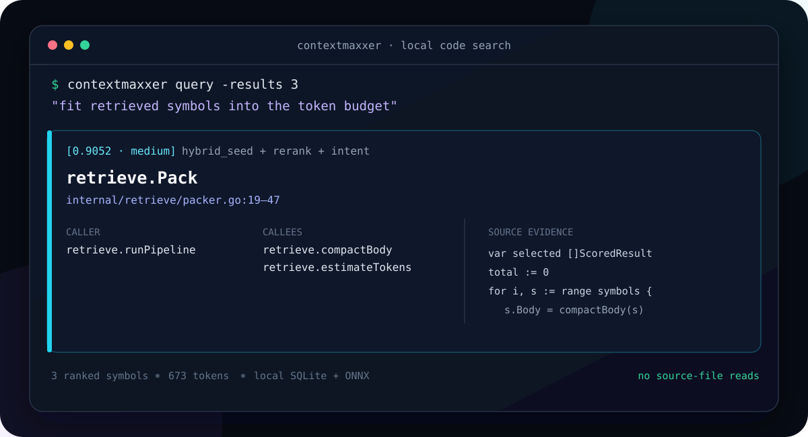
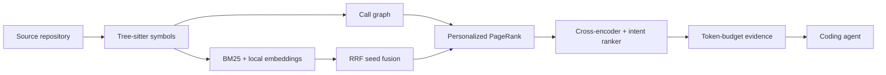

# Contextmaxxer

> Local code-graph search for coding agents.

Contextmaxxer gives Claude Code, Cursor and Codex an MCP tool for finding the
small set of symbols that answers a question — with source lines, callers,
callees and exact call sites already attached.

On CockroachDB's 90K symbols it answered 6/6 architecture questions with
**4.9× fewer discovery calls, zero source-file reads and 2.1× lower latency**
than grep-driven exploration. That is one paired run: repeats of this
measurement vary by up to 57%, so read it as an order of magnitude and not a
coefficient — [BENCHMARK.md](BENCHMARK.md) says exactly how much a single run is
worth. Zero source reads is the part that reproduces every time.

Everything needed for indexing and search runs locally. Your repository is not
uploaded to a search service.

## When to reach for it, and when not to

Use it on a **large codebase you do not already know**, especially when
following a call chain ("what actually runs when X happens") or when you cannot
name the thing you are looking for and have to describe it.

Use `grep` instead on a small or familiar repository, or when you already know
the symbol's name. A text search is hard to beat when the name is the query;
this tool earns its keep when the haystack is large and the question is about
behaviour rather than spelling.

## See the difference

Ask the agent a normal question:

    fit retrieved symbols into the token budget

Contextmaxxer returns the relevant implementation and its structural context in
one response:

    1. retrieve.Pack
       internal/retrieve/packer.go:19-47

        19 | func Pack(symbols []ScoredResult, budgetTokens int, fullBodyCount int) ([]ScoredResult, int) {
           |     ...
        27 |     var selected []ScoredResult
        28 |     total := 0
        29 |     for i, s := range symbols {
        30 |         if fullBodyCount >= 0 && i >= fullBodyCount {
        31 |             s.Body = compactBody(s)
        32 |             s.Detail = "compact"

       Called by:
       - retrieve.runPipeline

       Calls:
       - retrieve.compactBody                    packer.go:31
       - retrieve.estimateTokens                 packer.go:36

Two things matter in that block. The body arrives **line-numbered**, so the
agent can cite `packer.go:31` without reopening the file. And every neighbour
comes with the line where the call happens — following the chain into
`compactBody` costs no second search, whatever the size of the repository.

This example is a checked-in public self-eval case, not a prompt written after
seeing the ranking.

## Why use it

- **Fewer round-trips.** One semantic query replaces repeated glob, grep and
  file-read calls during code discovery.
- **Structure, not only similarity.** Retrieval uses symbols, lexical and vector
  search, the call graph, PageRank, a cross-encoder and an intent ranker.
- **Agent-ready evidence.** Results are packed to a token budget and include the
  relationships needed to follow a code path.
- **Local-first.** Indexes, embeddings and feedback logs stay on your machine.
- **Polyglot.** Thirteen languages, all with symbols and call edges; Go, Python
  and TypeScript resolve calls by declared type.

Contextmaxxer is designed for large codebases, where discovery fan-out becomes
the bottleneck. On small projects a strong model with grep is already cheap.

## Quick start

**There is no published release yet** — build from source for now. It takes one
command more than a download, and [Build from source](#build-from-source) has
the toolchain list. Prebuilt Windows amd64 and Linux amd64 archives are the
first thing on the [roadmap](ROADMAP.md).

1. Build the binary:

       task bootstrap && task build

   Output lands in `.task/build`.
2. Put it on PATH.
3. Pre-download the models and ONNX Runtime:

       contextmaxxer warmup

4. From the repository you want to search, wire it into your agent:

       contextmaxxer init --host claude-code .    # or: cursor, codex

5. Restart the agent and approve the contextmaxxer MCP server.

For a large repository, start with the structural index:

    contextmaxxer --fast init --host claude-code .

This makes symbol, lexical and graph retrieval available first. Run warmup when
you are ready for semantic search and reranking.

The init command merges the host configuration instead of replacing it. Use
**--no-write** to print the proposed configuration without changing host files.
See [INSTALL.md](INSTALL.md) for the full agent-oriented installation flow.

## How it works

The index is a local SQLite database. Embeddings and reranking run through ONNX
Runtime; an in-memory vector cache keeps the non-model portion of a warm query
under tens of milliseconds.

The MCP server exposes:

- **find_context** — ranked, line-numbered symbols with graph context;
- **expand_context** — the full indexed body of one result, when its excerpt
  cut the branch you needed; no second semantic search;
- **continue_context** — the next page when a response reports `status:more`;
- **record_feedback** — optional usefulness labels tied to a retrieval request.

With watch enabled, changed files are re-indexed incrementally. A fast index can
also backfill embeddings in the background.

## Measured results

### SWE-Explore: an external benchmark with published baselines

Everything else in this section is our own measurement. This one is not:
[SWE-Explore](https://arxiv.org/html/2606.07297v1) hands an explorer an issue
and a repository snapshot and grades the ranked `(file, start, end)` regions it
returns against line-level ground truth distilled from the trajectories of
agents that actually solved the task — what a solver had to READ, not what the
patch changed. Every baseline below is the paper's own number.

All 848 instances, line budget B = 500, served defaults:

| | **Contextmaxxer** | BM25 | TF-IDF | Potion (RAG) | CoSIL | Claude Code | Oracle |
|---|---:|---:|---:|---:|---:|---:|---:|
| HitFile | **0.529** | 0.079 | 0.140 | 0.088 | 0.544 | 0.667 | 0.923 |
| Prec | **0.339** | 0.055 | 0.117 | 0.055 | 0.581 | 0.598 | 1.000 |
| Rec_l | **0.047** | 0.021 | 0.049 | 0.025 | 0.788 | 0.154 | 0.953 |
| HitRegion | **0.375** | 0.065 | 0.121 | 0.069 | 0.544 | 0.531 | 0.915 |

Several times every non-agentic retriever, and within reach of
[CoSIL](https://www.arxiv.org/abs/2503.22424v1) on file coverage — the closest
comparison in kind, because it localises from a call graph too. CoSIL puts a
model *inside* the search loop, up to ten calls an issue; here the graph is
built once at indexing time and a query needs no model at all.

Read the rest honestly:

- **The agents are ahead on precision** (0.598 and 0.581 against 0.339), and
  CoSIL is ahead on every column. This is not a claim to beat them.
- **Line recall is our weakest number by an order of magnitude**, and it is a
  design position rather than a defect: bodies are trimmed to query-relevant
  windows, so a 500-line budget carries about 90 lines. Filling it is possible
  and costs precision — the paper's own analysis puts context efficiency at
  r = +0.950 with downstream resolve rate, above every recall measure.
- **The comparison is like-for-like.** Both sides are the same 848 instances;
  all three sub-datasets are complete. One snapshot was found truncated by an
  index-size check and re-fetched before scoring.

Protocol, per-repository breakdown, the sweeps, and the seven things that were
tried against the ceiling and failed are in
[docs/research/swe-explore.md](docs/research/swe-explore.md). The dataset is
CC-BY-NC-ND: numbers may be published, the data is not redistributed and no part
of it is in this repository.

### Agent-level discovery

Paired agents answered the same questions on pinned public repositories.

| Repository | Correctness | Discovery calls | File reads | Wall time |
|---|---:|---:|---:|---:|
| Prometheus, grep | 5/5 | 51 | 4 | 142 s |
| Prometheus, Contextmaxxer | 5/5 | **8** | **0** | **47 s** |
| CockroachDB, grep | 6/6 | 34 | 9 | 96 s |
| CockroachDB, Contextmaxxer | 6/6 | **7** | **0** | **45 s** |

Both rows are the runs written up in [BENCHMARK.md](BENCHMARK.md) — Prometheus
from the paired-sonnet comparison, CockroachDB from the v0.1.0-beta.5
replication on six paraphrastic questions. Each is a single run; the same
measurement repeated on one arm has come back 57% apart, so the ratios are
indicative and the zero source reads are the durable part.

Raw token savings are situational because the agent's own base context can
dominate total usage.

[BENCHMARK.md](BENCHMARK.md) has the questions, the protocol, the limitations
and the negative results.

### Retrieval quality

Start with the part you can run yourself. A public self-eval — 18 development
and 12 reserved queries over this repository — ships in `internal/eval/testdata`:

    go build -o .task/build/eval ./cmd/eval
    .task/build/eval --manifest internal/eval/testdata/manifest.public.json

Behind that, an internal 144-case corpus across five real projects was used
while developing the served configuration. Its 58-case reserved split measured
Hit@1 0.72, **Hit@3 0.91**, Recall@5 0.93, Recall@10 0.98. Those cases come from
private projects and are not published, so treat those numbers as our
development record rather than as something you can check.

### CORE-Bench: the retrieval stage, isolated

SWE-Explore above scores the whole product. CORE-Bench scores one stage of it,
and that is exactly what makes it worth running: the dataset ships its own
corpus — `{_id, text}` chunks with no paths, symbol names or kinds — so the
extractors, the call graph, PageRank and the intent ranker are not in this path
at all. What remains is the embedder and the seed fusion, measured against
numbers we did not produce. A whole-pipeline table like the one above cannot
exist here, and a benchmark that isolates one stage is the right instrument for
comparing models rather than systems.

Level-2 *issue-to-edit localization* ([arXiv:2606.11864](https://arxiv.org/abs/2606.11864),
HF `zhangfw123/CORE-Bench`): real GitHub issues as queries, per-query temporal
filters, 253 repositories, ~2,080 scoreable queries, ~2.2M corpus chunks. Every
row marked *paper* is the paper's own published number.

| Retriever | Params | NDCG@10 | Recall@100 |
|---|---:|---:|---:|
| *paper:* gte-Qwen2-1.5B, general-purpose | 1.5B | 0.035 | 0.159 |
| *paper:* bge-m3, general-purpose | 568M | 0.046 | 0.183 |
| **jina-v2-base-code + BM25, RRF** — shipped default | **161M** | **0.150** | **0.438** |
| *paper:* Qwen3-8B, zero-shot | 8B | 0.203 | — |
| *paper:* SweRankEmbed-Large (CC-BY-NC) | 7B | 0.224 | 0.521 |
| *research:* ft2 fine-tune + BM25, RRF | 161M | **0.233** | 0.498 |
| *paper:* Qwen3-8B-SFT, their fine-tune | 8B | 0.328 | 0.664 |

The shipped 161M default sits 3-4× above general-purpose embedders of 3.5× and
9× its size. A fine-tune of that same 161M encoder passes the 7B specialized
retriever on NDCG@10 — trained only on SWE-Bench-plus-plus, which shares no
repository with the evaluation set, so the gain is not contamination.

Fusion is where a small encoder earns that place. On the same full set:

| Seed stage | NDCG@10 | Recall@100 |
|---|---:|---:|
| vector only | 0.122 | 0.383 |
| vector + BM25, RRF-fused (k = 60) | **0.150** | **0.438** |

And the fine-tune's mechanism is the same effect again, which is the part worth
understanding: **vector-only NDCG@10 barely moves** under fine-tuning (0.142 →
0.141 on a repo-level holdout), while the fused score jumps 0.168 → 0.262. The
tuned model does not rank better on its own — it surfaces *different* relevant
chunks than BM25 does, and reciprocal rank fusion compounds two disagreeing
rankings. Two independent fine-tunes on disjoint training sets reproduced the
same relative gain (+56% and +55%) and the same flat-vector signature.

Read the limits with it:

- **Recall@100 stays below SweRankEmbed-Large** (0.498 against 0.521) even where
  NDCG@10 passes it. The fine-tune fixes ordering, not reach.
- **The paper's fine-tuned 8B remains clearly ahead** at 0.328. Nothing
  local-sized is close.
- **The sets are not identical.** Our evaluation excludes Multi-SWE-bench and
  the plus-plus split used for training; the paper's covers the full original.
- **This is a research result, not the install path.** The product default is
  **jina-embeddings-v2-base-code**; the fine-tuned weights are not described as
  distributed until weights, provenance and a model card are public.

Throughput on a consumer GPU: **49 docs/s** indexing, 51-76 ms per query embed.
Both the 0.6B upgrade candidate and a graph-blended fusion mode were measured
and rejected on this benchmark. [BENCHMARK.md](BENCHMARK.md) has the evaluation
boundary, the per-repository reproduction and every negative result.

## Supported languages

Full, type-aware call resolution:

- Go
- Python
- TypeScript and JavaScript

Symbols and conservative call edges:

- Java
- Rust
- C
- C++
- C#
- PHP
- Ruby
- Kotlin
- Scala

## Enrichment

Most symbols do not have useful docstrings. Contextmaxxer can add one-sentence
purpose summaries to the embedding text:

1. generated by the installed coding agent;
2. generated by a local Ollama or LM Studio endpoint;
3. generated by an explicitly configured OpenAI-compatible API.

The first two paths stay local. The optional cloud path sends the selected
symbol metadata and code excerpt to the endpoint you configure. It is never
used implicitly.

See [BETA.md](BETA.md) for the current enrichment workflow.

## Privacy

- Source code and indexes remain local during indexing and retrieval.
- A retrieval reaches the log only once something labels it — the agent calling
  `record_feedback`, or the discovery hook observing that it reached for grep
  straight afterwards. Unlabelled queries are discarded.
- Between a query and its label, the most recent request waits in a single
  `feedback.jsonl.pending` file, overwritten on every call and removed as soon
  as it is labelled or discarded. That file is what lets the hook, which runs
  as its own process, attribute what it sees.
- What a labelled entry contains: the query, file paths, symbol names and
  ranking features — never complete source bodies.
- The log is capped at 64 MB and keeps one previous generation
  (**CONTEXTMAXXER_FEEDBACK_MAX_MB**). **CONTEXTMAXXER_FEEDBACK_ALL=1** logs
  every response instead, for debugging ranking.
- Disable feedback entirely with **--feedback-log none**.
- A redacted export hashes queries, paths and names before sharing.
- Optional cloud enrichment sends code excerpts only when you explicitly
  configure an external endpoint.

## Build from source

Source builds require Go, Rust and a C/C++ toolchain because the Hugging Face
tokenizer binding is a Rust static library linked through CGo.

    task bootstrap
    task test
    task build

Build output goes to .task/build; it does not overwrite a binary in the
repository root.

The bootstrap scripts fetch one pinned upstream tokenizer commit and build it
with a pinned Rust toolchain. Windows requires a MinGW-compatible gcc.

## Current limitations

- The first warmup downloads several hundred megabytes of models and runtimes.
- Windows amd64 and Linux amd64 are the initial release targets. macOS is not
  packaged yet, and Intel macOS is unsupported outright — upstream ONNX Runtime
  publishes no x86_64 darwin build for the pinned version.
- CPU cross-encoder reranking is the dominant part of query latency.
- Benefits are modest on small repositories.
- Public reproduction currently covers the product's self-eval and the pinned
  Prometheus experiment, not the private multi-project corpus.

## Project status

Contextmaxxer is preparing for its first public beta. The retrieval engine is
actively dogfooded, and Windows/Linux clean builds plus release archives have
been validated locally. GitHub-hosted CI remains the final distribution check
once the public repository exists.

Detailed references:

- [INSTALL.md](INSTALL.md) — installation and host setup
- [BETA.md](BETA.md) — beta workflow and feedback
- [BENCHMARK.md](BENCHMARK.md) — product benchmark and research log
- [docs/evaluation.md](docs/evaluation.md) — reproducible public self-eval
- [docs/research](docs/research/README.md) — research scope and artifact status
- [ARCHITECTURE-NOTES.md](ARCHITECTURE-NOTES.md) — design positioning and limits
- [CONTRIBUTING.md](CONTRIBUTING.md) — development and pull requests
- [SECURITY.md](SECURITY.md) — private vulnerability reporting
- [CHANGELOG.md](CHANGELOG.md) — notable public changes
- [ROADMAP.md](ROADMAP.md) — release direction and research gates

## License

[MIT](LICENSE) © 2026 codeus-morbid
